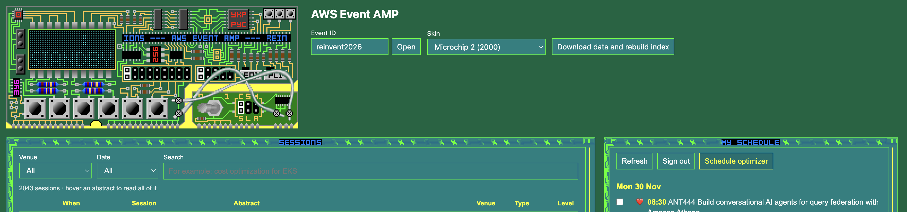

# AWS Event AMP



A small Python client for the [AWS Events API](https://api.awsevents.com/v1/openapi.json)
attendee flow. Use it to browse events and sessions, manage your schedule
(reservations, favorites and personal time), and search an event's full session
catalog by keyword, by meaning, or both.

It has three parts:

- **`aws_events/`**: a Python package with the API client, AWS Builder ID sign-in,
  and session search. Use it from your own code.
- **`events_cli.py`**: a command-line interface on top of that package.
- **`events_web.py`**: a web app (FastAPI + HTMX) for searching sessions and
  building your favorites list, which can wear classic Winamp skins.

## Setup

You need Python 3 (developed and tested on 3.14).

```bash
git clone <this repository> aws-events-app
cd aws-events-app

python3 -m venv venv
source venv/bin/activate

pip install -r requirements.txt
```

All commands below assume the virtual environment is active (`source venv/bin/activate`).

### Sign in

Browsing events needs no account. Everything that touches your schedule, and
the session catalog of events like re:Invent that require attendee sign-in,
needs an AWS Builder ID:

```bash
python3 events_cli.py login
```

This opens AWS Builder ID sign-in in your browser. After you sign in, the
browser redirects to `http://localhost:8484/callback`, so port 8484 must be free.
Tokens are saved to `~/.aws-events-token.json` (readable only by you) and are
refreshed automatically. If the saved sign-in has expired for good, a new
browser sign-in starts. You don't need to run `login` first: any command that
needs sign-in starts it for you.

Sign-in gives up after 5 minutes if you don't finish it in the browser. If port
8484 is busy (usually because another sign-in is still waiting), you get an
error saying so. Finish or close the other sign-in and try again.

To forget the saved sign-in:

```bash
python3 events_cli.py logout
```

## Using the CLI

Run `python3 events_cli.py --help` for the full command list, or
`python3 events_cli.py <command> --help` for a single command. Commands print
JSON, so you can pipe them into tools such as `jq`.

The examples use re:Invent 2026 (`reinvent2026`).

### Events

```bash
# Ongoing and upcoming events
python3 events_cli.py events

# Include events that have already ended
python3 events_cli.py events --include-past

# One event
python3 events_cli.py event reinvent2026
```

### Sessions

```bash
# Every session in the catalog (fetches all pages; re:Invent has about 2,000)
python3 events_cli.py sessions reinvent2026

# Smaller output: leave out the abstracts
python3 events_cli.py sessions reinvent2026 --no-abstracts

# Localized text, where the event provides it
python3 events_cli.py sessions reinvent2026 --locale en-US

# One session
python3 events_cli.py session reinvent2026 1780441461150001GGoc
```

> **Session IDs are not session codes.** At re:Invent a session's code is
> something like `ANT301`, but its ID is `1780441461150001GGoc`. Every command
> that takes a session needs the **ID**. Find it in the `sessionId` field, or in
> the `id` shown by `search`.

### Your schedule

```bash
# Reserved session IDs, favorite session IDs and personal time blocks
python3 events_cli.py schedule reinvent2026

# The same, with full details for each reserved and favorite session
# (one extra request per session)
python3 events_cli.py schedule reinvent2026 --details
```

### Booking (reservations)

The API calls a booking a reservation. `book` and `unbook` are the same
commands as `reserve` and `cancel`; use whichever you prefer.

```bash
# Book one to ten sessions at once
python3 events_cli.py book reinvent2026 1780441461150001GGoc 1780441461234001G5fg

# Cancel one booking
python3 events_cli.py unbook reinvent2026 1780441461150001GGoc
```

If the event hasn't opened booking yet (the API answers HTTP 409, "operation
disabled"), `book` stops with "This feature is not yet enabled". The web app
shows the same message. Other operations the API has switched off behave the
same way.

Some sessions in a `reserve` call can fail while others succeed, so always check
the `failed` list in the output. A session you already hold is also reported
there, so re-running the same command is not a safe retry.

### Favorites

A favorite records interest only; it does not reserve a seat.

```bash
# Favorite one to ten sessions
python3 events_cli.py favorite reinvent2026 1780441461150001GGoc 1780441461294001GVt3

# Remove one favorite
python3 events_cli.py unfavorite reinvent2026 1780441461294001GVt3
```

As with reservations, check the `failed` list after `favorite`.

### Personal time

Personal time blocks are time on your schedule that isn't a session, such as a
lunch or a customer meeting.

Times are **UTC**, written `YYYY-MM-DDTHH:MM:00`, and the length must be a
multiple of 5 minutes. re:Invent runs on Pacific Standard Time (UTC−8), so
12:00–13:00 in Las Vegas on 2 December is 20:00–21:00 UTC:

```bash
python3 events_cli.py add-personal-time reinvent2026 \
    --title "Lunch" \
    --description "Lunch with the team" \
    --start 2026-12-02T20:00:00 \
    --end 2026-12-02T21:00:00 \
    --location "Venetian food court"
```

To change or remove a block, get its `personalTimeId` from
`schedule reinvent2026` (under `personalTime`). An update replaces the whole
block, so pass every field again. Anything you leave out, such as `--location`,
is cleared.

```bash
python3 events_cli.py update-personal-time reinvent2026 PERSONAL_TIME_ID \
    --title "Lunch" \
    --description "Lunch with the team, moved later" \
    --start 2026-12-02T21:00:00 \
    --end 2026-12-02T22:00:00

python3 events_cli.py delete-personal-time reinvent2026 PERSONAL_TIME_ID
```

### Searching sessions

Search runs locally against a copy of the session catalog, in three steps.

**1. Download the catalog** to `data/reinvent2026-sessions.json`:

```bash
python3 events_cli.py download-sessions reinvent2026
```

**2. Build the search index** at `data/reinvent2026-vectors.json`:

```bash
python3 events_cli.py build-index reinvent2026
```

This embeds every session with the `BAAI/bge-small-en-v1.5` model, which runs
locally on your CPU through [FastEmbed](https://github.com/qdrant/fastembed). No
API key is needed and no session data leaves your machine. The first run
downloads the model (about 70 MB). re:Invent's roughly 2,000 sessions took
about 3 minutes to index on a 12-core laptop and made a 25 MB index file. After
that, each search takes 2–3 seconds.

**3. Search:**

```bash
python3 events_cli.py search reinvent2026 "cost optimization for EKS"
```

Example output:

```text
1. [CON407] Optimize analytics workloads on Amazon EKS for performance and cost
   2026-12-03 08:30 | MGM Grand | score 0.032 | id 1780442278296001ct59
2. [CON343] Multi-tenant compute modernization with Amazon EMR on EKS
   2026-12-02 13:00 | Caesars Forum | score 0.031 | id 1786043770068001qnHC
3. [HMC206-S] Stop paying for idle GPUs on Amazon EKS (sponsored by Apptio)
   2026-12-01 16:30 | Venetian | score 0.030 | id 1780442270680001csK4
...
```

Times are the event's local time. Hybrid scores only rank results against
each other; they aren't percentages.

Choose how the query is matched with `--mode`:

| Mode | How it matches | Best for |
|---|---|---|
| `hybrid` (default) | Merges the keyword and semantic rankings | Most searches |
| `semantic` | Meaning, using the embeddings | Describing a topic in your own words |
| `keyword` | Exact words, ranked with BM25 | Session codes (`ANT301`), service names, speaker names |

```bash
python3 events_cli.py search reinvent2026 "ANT301" --mode keyword
python3 events_cli.py search reinvent2026 "getting started with AI agents" --mode semantic --limit 20
```

Narrow results to one venue, one day, or both, with `--venue` and `--date`.
Filters are applied before results are cut to `--limit`, so you still get up to
10 matching sessions:

```bash
python3 events_cli.py search reinvent2026 "EKS cost" --venue "MGM Grand" --date 2026-12-02
```

Venue names must match exactly: at re:Invent 2026 they are `Caesars Forum`,
`MGM Grand` and `Venetian`. Many sessions don't have a venue yet, and a venue
filter leaves those out.

Use the `id` from the results with `session`, `reserve` or `favorite`.

After you run `download-sessions` again to pick up catalog changes, run
`build-index` again too, so new sessions can be found.

These files are always saved in the `data/` folder at the project root,
wherever you run the command from. `data/` is in `.gitignore`. To keep them
somewhere else, pass `--catalog PATH` and `--index PATH` to any of the three
commands.

## Using the web app

```bash
python3 events_web.py
```

Then open <http://127.0.0.1:8000>. Use `--port` to pick another port. The app
listens only on your own machine, because it acts with your AWS Builder ID
sign-in.

- **Top:** choose the event (default `reinvent2026`) and a skin.
  **Download data and rebuild index** runs `download-sessions` and
  `build-index` for you. Use it the first time, and whenever you want the latest
  catalog. For re:Invent it takes about 3 minutes, and progress shows under the
  button.
- **Sessions (left):** filter by venue and date. With the search box empty, the
  table lists every matching session in time order, 100 at a time (**Show
  more** loads the next 100). Type a query to see the top 10 hybrid-search
  matches within the filters. **Hover over an abstract to read all of it.**
  Tick rows, then click **Add selected to favorites** or **Book selected** (up
  to 10 at a time; booking asks you to confirm). The first column marks
  sessions already on your schedule: ✅ booked, ❤️ favorite, always in that
  order so the icons line up.
- **My schedule (right):** your booked and favorite sessions, grouped by day in
  time order. Tick sessions, then click **Remove selected from favorites** or
  **Book selected**. Both panels update after every change. **Refresh** picks up
  changes made elsewhere, such as on the event website, and **Sign out** forgets
  your sign-in.

  If the API refuses a session, the message says why in plain words and names
  the session by its code. For example, "ANT417-R clashes with DAT317 on your
  schedule", or that a session is full, has already started, or isn't open for
  booking. The rest of the selection still goes through.

### Schedule optimizer

Click **Schedule optimizer** in My schedule to open a page that trims your
favorites down to a day you can actually attend. **Back** returns to the main
page. The page shows one table per day, side by side like a calendar, with your
favorite and booked sessions in time order.

Before changing anything, the page recommends you **Backup favorites**: it
downloads a CSV of every current favorite (session ID, code, title, date, start
time, length, venue, room, and whether it's booked).

- **Max venues** (per day): 1 keeps you at one venue all day, 2 allows one move,
  3 allows two, and so on; going back to a venue counts as a move too. Each
  move must leave time to travel. Following AWS's advice to allow 30–45 minutes:
  30 to walk between Venetian and Wynn/Encore, Caesars Forum or Caesars Palace,
  or between the two Caesars venues; 45 by shuttle between Wynn/Encore and
  either Caesars venue; 60 to or from MGM Grand. The table is `TRAVEL_MINUTES`
  in `aws_events/schedule_optimizer.py`.
- **Must attend**: ticked sessions are kept ahead of everything else. Booked
  sessions show ✅ instead of a box: they are always kept and can't be unticked,
  since the page doesn't cancel bookings. If two must-attend sessions clash,
  the page says which one couldn't fit.
- **Optimize schedule** keeps the largest set of sessions that fits these
  rules. Each day notes its route, such as "1 move: Venetian → MGM Grand
  (60 min travel)". Ties go to fewer moves, then less travel, then an earlier
  finish. Optimizing again always starts from all your favorites, so you can
  change the settings and rerun it.
- **Start over** reloads every favorite and clears your choices.
- **Apply to favorites** removes the favorites the optimizer left out, after
  asking "Are you sure? N session(s) will be deleted from your favorites."
  Booked sessions are never removed or cancelled.
- **Book these sessions** books every kept session that isn't booked yet.

Sessions without a time yet are left out of the grid and never removed.

**Signing in.** The web app never starts a sign-in by itself. If you aren't
signed in, or your saved sign-in has expired, My schedule shows a **Sign in**
button, and **Add selected to favorites** is disabled. Search and filters work
without signing in. **Sign in** opens AWS Builder ID sign-in in a new tab and
shows a link on the page in case the tab didn't open. Finish within 5 minutes.
For events that require sign-in to view sessions, such as re:Invent, sign in
before using **Download data and rebuild index**.

The web app and the CLI share the same saved sign-in and the same `data/` files.

### Winamp skins

Pick a skin from the **Skin** menu. Your choice is remembered in this browser.
The page is then drawn with the skin's own artwork:

- The header becomes Winamp's main window, with your event scrolling across it
  in the skin's bitmap font. Its buttons work:
  - ⏮ and ⏭ move back and forward a day.
  - ▶, ⏸ and ⏹ clear all filters and the search.
  - ⏏ downloads data and rebuilds the index, after asking.
  - Shuffle and Repeat refresh the session list.
- The Sessions and My schedule panels are framed like Winamp's playlist window,
  in the colors and font from the skin's `pledit.txt`. If a skin's text colors
  are hard to read (for example dark red on black), a more readable color from
  the skin is used for body text.
- The page behind the windows takes the skin's primary color: the most common
  color in its main window, ignoring the black display areas most skins have.
  The page title and labels switch between light and dark text to stay readable.

The menu offers Winamp's default skin plus the 10 most-liked skins from the
Winamp 2 era (1997–2003) on the [Winamp Skin Museum](https://skins.webamp.org/),
ranked by likes on the Museum's posts. Choose **No skin** for a plain, modern
look.

Skins are downloaded from the Museum the first time you pick them and cached in
`data/skins/`. The skin files are not part of this repository.

**Adding a skin.** Add an entry to `web/skins.json` and restart the app:

```json
{
  "id": "my-skin",
  "name": "My Skin",
  "year": 2001,
  "url": "https://r2.webampskins.org/skins/<md5>.wsz",
  "museum_url": "https://skins.webamp.org/skin/<md5>/"
}
```

- `id` (used in URLs and cookies) and `name` are required, plus either `url` or
  `file`.
- `url` is where to download the `.wsz` from. For a Museum skin, the `<md5>` is
  in its Museum page's address.
- Use `"file": "skins/my-skin.wsz"` instead of `url` for a `.wsz` on disk,
  relative to the project root.
- `year`, `likes` and `museum_url` are optional. The year is shown in the menu.

Only classic (Winamp 2) `.wsz` skins work; modern Winamp 3/5 `.wal` skins don't.
A skin missing any of the files the page uses (`main.bmp`, `titlebar.bmp`,
`cbuttons.bmp`, `text.bmp`, `pledit.bmp`, `pledit.txt`) borrows them from the
default skin, as Winamp does. `default_skin` at the top of the file sets the
skin new visitors see.

## Using the package from Python

```python
from aws_events import (
    Authenticator, EventsClient, FastEmbedEmbeddings, HttpTransport,
    SessionCatalog, SessionFilter, SessionSearch, SessionVectorStore, TokenStore,
)

transport = HttpTransport()
client = EventsClient(transport, Authenticator(TokenStore(), transport))

schedule = client.get_schedule("reinvent2026", include_session_details=True)
for session in schedule["reserved"]:
    print(session["abbreviation"], session["title"])

catalog = SessionCatalog.download(client, "reinvent2026")
vector_store = SessionVectorStore.build(catalog, FastEmbedEmbeddings())
search = SessionSearch(catalog, vector_store)
for result in search.hybrid_search("serverless", limit=5):
    print(result.session["title"])

# Only sessions at MGM Grand on 2 December
mgm_on_wednesday = SessionFilter(venue="MGM Grand", date="2026-12-02")
results = search.search("serverless", limit=10, session_filter=mgm_on_wednesday)
```

## Project layout

```text
aws_events/
    client.py        EventsClient: every AWS Events API operation
    auth.py          Authenticator and TokenStore: AWS Builder ID sign-in and tokens
    transport.py     HttpTransport: the only code that makes HTTP requests
    catalog.py       SessionCatalog and SessionFilter: local copy of an event's sessions
    vector_store.py  SessionVectorStore and FastEmbedEmbeddings: semantic search index
    search.py        SessionSearch: keyword, semantic and hybrid search, with filters
    schedule.py      Group the attendee's schedule by day for display
    schedule_optimizer.py  Pick the most sessions per day within venue and travel limits
    errors.py        EventsError, ApiError, SignInError
web/
    app.py           FastAPI routes: pages and HTMX partials
    services.py      Shared state: API client, cached search indexes, background jobs
    skins.py         Winamp skin list (skins.json), download cache and .wsz reader
    jobs.py          Background jobs for sign-in and rebuilding the index
    views.py         Formatting for the templates
    optimizer.py     The schedule optimizer page's day-by-day grid
    skins.json       The skins offered in the Skin menu
    templates/       Jinja2 templates (base.html, index.html, optimizer.html and
                     the HTMX partials)
    static/          app.css, skin.js (draws the skin), htmx.min.js (vendored HTMX 2.0.11)
events_cli.py        Command-line interface
events_web.py        Starts the web app
tests/               Unit tests (no network or browser needed)
docs/                Images used in this README
data/                Downloaded catalogs, search indexes and skins (created on first use)
```

## Running the tests

```bash
python3 -m unittest discover -s tests -t .
```
